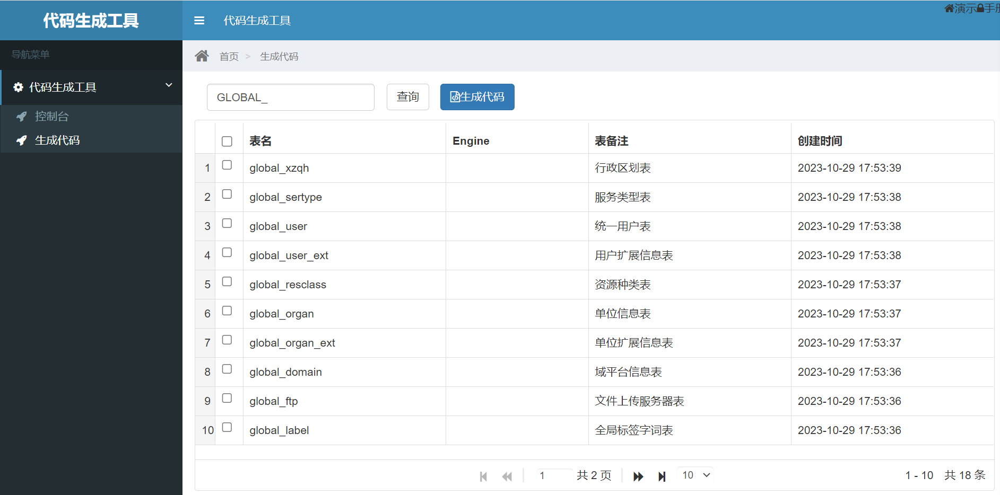

# java-tools-generate

## Description
```
- JAVA Utils，generate code by Velocity template，use Model、View and Controller design
- Springboot Application，generate Model code include: entity、xml、dao、service files，View code include: vo、manager files，Controller code include: api controller files.
- vue2 code
- ts and vue3 code
- support mysql、Oracle database

```

## Version

```
2.3.1       2023-11-27  修改英文说明文件，增加distributionManagement属性，发布到github
2.3.1       2023-11-26  完善README.md文件，更新模板，调整文件资源，遗留问题：
                        1、资源返回对象调整为data，jgGrid显示不正常
                        2、oracle的脚本Dao文件和Datasource配置未实现
2.3.0       2023-10-19  路径调整，文件资源更新，遗留问题：
                        
2.2.0       2023-07-22  进行POM内配置调整和精简，增加java-api-doc目录，进行文档验证
2.1.0       2023-06-18  创建版本，进行结构划分，打包验证及本地发布

```

## Technical Route
### Software Architecture
```
1. Springboot framework
2. AdminLte、Bootstrap components
3. Velocity template
4. vue3、ts，create，insert，delete，modify，search
```

### Installation
```
1. mvn clean install
2. mvn clean deploy
```

## Use Effect


## Contribute
1.  Fork repository
2.  create Feat_1.0.0 branch
3.  commit code
```
git config user.name linlaninfo
git config user.email linlanio@qq.com
```
4. create Pull Request
5. create and push tag
```
create
git tag -a v2.3.1 -m "完善README.md文件，更新模板，调整文件资源"
view
git tag
push
git push origin --tags
delete
git tag -d v2.3.1
```
6. other

## contact us
```
website：https://www.linlan.io
email：contact@linlan.io
```