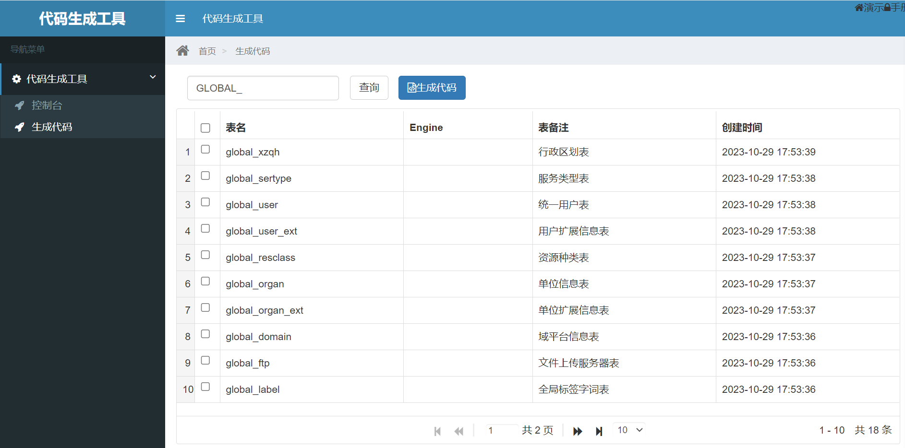

# java-tools-generate

## 项目说明
```
- JAVA代码工具类，根据模板生成默认代码块，采用Model、View和Controller架构分层设计
- 代码生成系统，可在线生成后台Model域的entity、xml、dao、service文件，View域的vo和manager文件，Controller域的api文件
- 可生成前台的vue、ts代码，减少重复的开发工作
- 代码生成系统支撑mysql数据库、Oracle数据库生成

```

## 版本历史

```
2.3.1       2023-11-26  完善README.md文件，更新模板，调整文件资源，遗留问题：
                        1、资源返回对象调整为data，jgGrid显示不正常
                        2、oracle的脚本Dao文件和Datasource配置未实现
2.3.0       2023-10-19  路径调整，文件资源更新，遗留问题：
                        
2.2.0       2023-07-22  进行POM内配置调整和精简，增加java-api-doc目录，进行文档验证
2.1.0       2023-06-18  创建版本，进行结构划分，打包验证及本地发布

```

## 技术路径
### 软件架构
```
1. 基于Springboot框架
2. 后台采用AdminLte和Bootstrap组件进行支撑
3. 页面模板采用Velocity模板
4. 前台支撑vue3和ts，实现增删改查通用功能
```

### 安装教程
```
1. mvn clean install
2. mvn clean deploy
```

## 应用效果


## 参与贡献
1.  Fork 本仓库
2.  新建 Feat_1.0.0 分支
3.  提交代码
```
git config user.name linlaninfo
git config user.email linlanio@qq.com
```
4. 新建 Pull Request
5. 创建和提交tag
```
创建
git tag -a v2.3.1 -m "完善README.md文件，更新模板，调整文件资源"
查看
git tag
提交
git push origin --tags
删除
git tag -d v2.3.1
```
6. 其他

## 联系我们
```
网站：https://www.linlan.io
邮箱：contact@linlan.io
```